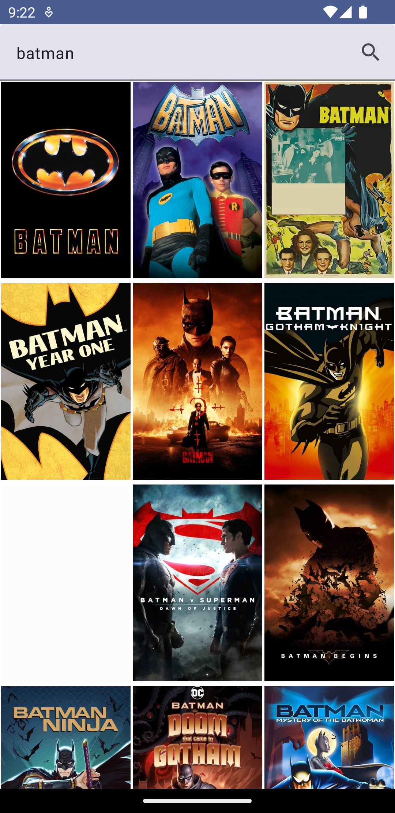

# MoviesApp Modularized

This is an example for a modularized architecture movies app. This modularization is based on
feature layered modularization, that means that **each feature is a module and each module has its
own layers (data, domain, presentation)**.

| Home                     | Search List                            | Movie Detail                             |
|--------------------------|----------------------------------------|------------------------------------------|
|  |  |  |

> **Requirements**
> You need to create an account in [The Movie Database](https://www.themoviedb.org/) and get an API
> key.
> Then replace the value of `API_KEY` in the viewModel files.
> [Settings API](https://www.themoviedb.org/settings/api)

## 1. Creating our `buildSrc` module

The first step is to create a `buildSrc` module. This module will contain all the configuration that
we will use in our project, like the version of the app. This module will be imported in
our `build.gradle` file in the root of our project.

- Change the view to `Project` in the Android Studio Project view.
- Create a new directory called `buildSrc` in the root of the project.
- Create a new file called `build.gradle.kts` in the `buildSrc` directory.
- Add the following code to the `build.gradle.kts` file:

```kotlin
import org.gradle.kotlin.dsl.`kotlin-dsl`

repositories {
    mavenCentral()
}

plugins {
    `kotlin-dsl`
}
```

- Now create a new directories called `src/main/kotlin` or `src/main/java` in the `buildSrc` directory.
- Create a new file called `Dependencies.kt` or the name that you prefers in the `src/main/kotlin` directory.


## 2. Creating our Version Catalog file in the `gradle` folder

[Gradle version catalogs](https://developer.android.com/build/migrate-to-catalogs) enable you to add and maintain dependencies and plugins in a scalable way. Using Gradle version catalogs makes managing dependencies and plugins easier when you have multiple modules. Instead of hardcoding dependency names and versions in individual build files and updating each entry whenever you need to upgrade a dependency, you can create a central version catalog of dependencies that various modules can reference in a type-safe way with Android Studio assistance.

Version Catalog `libs.version.toml` is a file that contains all the versions of the dependencies that we will use in our project.

- Create a file called `libs.versions.toml` in the `gradle` folder.
- Add all the dependencies that you need. The structure of the file is the following:
    - **versions**: In the versions block, define variables that hold the versions of your dependencies and plugins. You use these variables in the subsequent blocks (the versions and plugins blocks).
    - **libraries**: In the libraries block, define your dependencies.
    - **plugins**: In the plugins block, define your plugins.
    - **bundles**: In the bundles block, define your dependency bundles, which are groups of dependencies that you can import together.

## 3. Creating our project structure

It's created the base structure for the application. This application will be divided in multiple modules. Each module represents a feature in our app and it will have its own layers (data, domain, presentation).

Also, we will have a `core` module that will contain all the common code that we will use in our app.

- Each module will be created using the `New Module` option in Android Studio and the option `Android Library`.
- The convention for the name of the modules is the following: `:feature:layer`. For example, `:movies:data`.
- The package name for each module will be the following: 
  - `com.feature._featureName_._layer_`. For example, `com.feature.movies.data`
  - `com.feature._featureName_._layer_`. For example, `com.feature.movies.domain`
  - `com.feature._featureName_._layer_`. For example, `com.feature.movies.ui`
  - `com.feature._featureName_._layer_`. For example, `com.feature.movie_detail.data`
  - `com.feature._featureName_._layer_`. For example, `com.feature.movie_detail.domain`
  - `com.feature._featureName_._layer_`. For example, `com.feature.movie_detail.ui`


- For `core` module the convention for the name of the modules is the following: `:core:moduleName`. For example, `:core:network`.
- For the `core` module, the package name will be the following:
    - `com.core._layer_`. For example, `com.core.network`
    - `com.core._layer_`. For example, `com.core.common`


```
    :app/
    :buildSrc/
    :core/
    ├── :common/
    ├── :network/
    ├── :feature_api/
    :feature/
    ├── :movie
    │   ├── :data
    │   ├── :domain
    │   └── :ui
    └── :movie_detail
        ├── :data
        ├── :domain
        └── :ui
```

## 4. Using `FeatureApi` to expose the feature modules

The `feature_api` module will be used to expose the feature modules to the `app` module. This module
will be used to inject the dependencies of the feature modules in the `app` module.

```kotlin
interface FeatureApi {

  fun registerGraph(
    navController: NavHostController,
    navGraphBuilder: NavGraphBuilder
  )

}
```

Each feature module will implement this interface and will register its graph in the `app` module.

```kotlin
interface MovieApi : FeatureApi

class MovieApiImpl : MovieApi {
  override fun registerGraph(navController: NavHostController, navGraphBuilder: NavGraphBuilder) {
    InternalMovieFeatureApi.registerGraph(navController, navGraphBuilder)
  }

}
```

```kotlin
object InternalMovieDetailsApi : FeatureApi {
  override fun registerGraph(navController: NavHostController, navGraphBuilder: NavGraphBuilder) {
    navGraphBuilder.navigation(
      startDestination = MovieDetailsFeature.movieDetailsScreenRoute,
      route = MovieDetailsFeature.nestedRoute
    ) {
      composable(MovieDetailsFeature.movieDetailsScreenRoute) {
        val id = it.arguments?.getString("id")
        val viewModel = hiltViewModel<MovieDetailsViewModel>()
        val state = viewModel.movieDetails.value

        MovieDetailScreen(
          state = state,
          onNavigateUp = {
            navController.navigateUp()
          }
        )
      }
    }
  }
}
```

The `app` module will have a `navigation` package that will contain the `AppNavigation.kt` file.
This file will be used to register the navigation graph of the app.

_AppNavigation.kt_

```kotlin
@Composable
fun AppNavGraph(
  navController: NavHostController,
  navigationProvider: NavigationProvider
) {
  NavHost(
    navController = navController,
    startDestination = MovieFeature.nestedRoute
  ) {
    navigationProvider.movieApi.registerGraph(
      navController = navController,
      navGraphBuilder = this
    )

    navigationProvider.movieDetailsApi.registerGraph(
      navController = navController,
      navGraphBuilder = this
    )
  }
}
```

_NavigationProvider_

```kotlin
data class NavigationProvider(
  val movieApi: MovieApi,
  val movieDetailsApi: MovieDetailsApi,
)
```